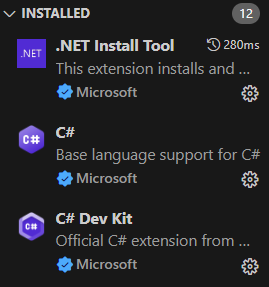
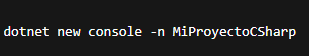
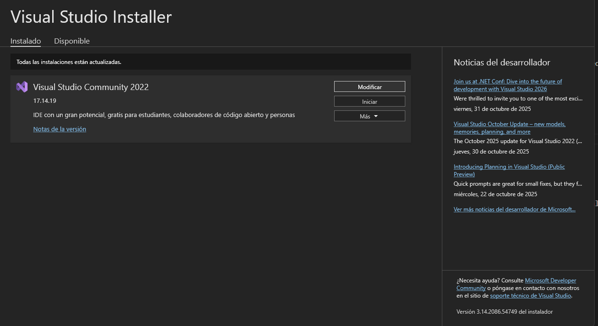
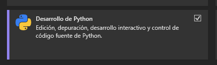
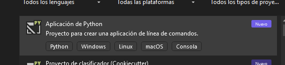
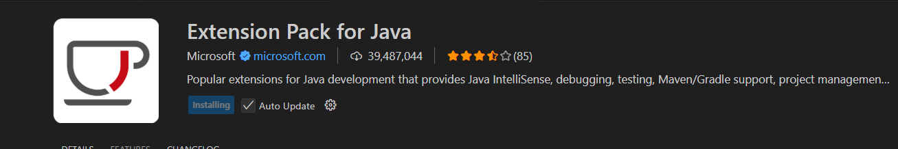
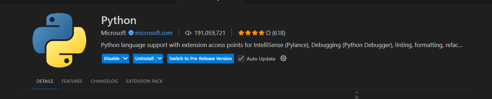
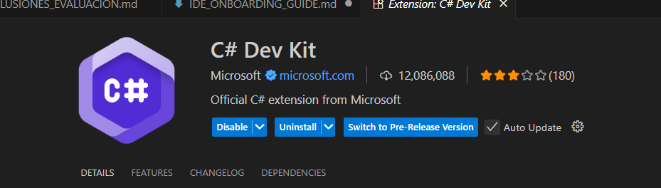

# Guía de Configuración de Entornos de Desarrollo

> 📋 **Guía Técnica**: Esta documentación establece los procedimientos para configurar un entorno de desarrollo en C# y otros lenguajes. Incluye las configuraciones necesarias para mantener consistencia en el desarrollo de software.

> **Nota importante**: Este documento se enfoca en aspectos técnicos y procedimientos. Para análisis comparativos, reflexiones personales y conclusiones, utiliza el archivo `CONCLUSIONES_EVALUACION.md`.

**Autores**: Daniel Ontavilla y José André
**Fecha V0**: [Fecha de entrega inicial]
**Fecha V1**: [Fecha de entrega final]

---

## Visual Studio Code - Entorno Principal

### Instalación y Verificación

**Método de instalación:** Desde la página oficial de Visual Studio Code:
 https://code.visualstudio.com/ 

> **💡 Sobre las imágenes**: Incluye capturas de pantalla para mostrar los diferentes pasos o resultados. Ejemplo: `

**Proceso de instalación:**
- **Descarga:** Acceder a la página de descarga y seleccionar la versión correspondiente al sistema operativo (Windows, macOS o Linux).
Finalizar la instalación y ejecutar VS Code.


- **Opciones del instalador:** Ejecutar el instalador y mantener las opciones por defecto, marcando:

“Agregar a PATH”
“Registrar como editor de código soportado”


- **Verificación:** Abrir la terminal integrada (`Ctrl+``) y ejecutar:

code --version

Si aparece el número de versión la instalación esta correcta


### Uso Básico de VS Code

**Navegación y funcionalidades básicas:**

Navegación por el panel lateral (Explorador, Buscar, Control de versiones, Depuración, Extensiones)
Edición de código con soporte para resaltado de sintaxis y autocompletado
Uso de la paleta de comandos (Ctrl+Shift+P)
Administración de proyectos mediante carpetas

### Personalización del Entorno

**Configuraciones aplicadas:** 

se ha cambiado el tema por uno oscuro para no tener fatiga visual ademas de instalar el git 

**Temas e iconos:**

Temas: One Dark Pro, Material Theme

Iconos: Material Icon Theme, VSCode Icons

**Configuración de fuentes:**

- Fira Code, JetBrains Mono (con ligaduras)

**Atajos de teclado útiles:**

- Ctrl+/ para comentar/descomentar
- Ctrl+Shift+P para paleta de comandos
- Ctrl+` para terminal integrada
- Alt+↑/↓ para mover líneas
- Control + K M para cambiar el idioma
- Shift + Alt + , para corregir errores menores
  


**Configuración del editor:**

- Formateo automático al guardar
- Detección automática de indentación
- Word wrap para líneas largas

**Terminal integrada:**
Ejemplos:
- PowerShell como terminal predeterminado
- Configuración de perfil personalizado

> **Personaliza según tus necesidades**: Estas son sugerencias basadas en prácticas comunes. Experimenta y documenta las configuraciones que encuentres más útiles para tu flujo de trabajo.> 💼 **Manual de Incorporación**: Esta guía establece los estándares del equipo para configurar entornos de desarrollo en C#. Cualquier nuevo desarrollador debe poder seguir estas instrucciones para configurar su entorno de trabajo de manera consistente con el resto del equipo.

### SDK .NET

**Proceso de instalación:**
1. **Descarga e instalación:** [Describir el proceso]
   

    Primero nos tenemos que meter a la pagina de Microsoft para instalar SDK.net


Seleccionamos la version NET 9.0 el de x64 


Ejecutamos el archivo que nos descarga y nos aparecera esta ventana, le tendremos que dar a instalar y ya tendriamos instalados SDK.NET

2. **Verificación:** [Cómo comprobar que funciona]
   


Para comprobar que se ha instalado correctamente nos metemos en la terminal y ejecutamos el comando dotnet --version y si te aparece lo que hay en la imagen (9.0.306 la version que instalaste) ya has comprobado que has instalado correctamente SDK.

### Configuración para C#

**Extensiones esenciales:**
- **Soporte oficial para C#**: Extensión que proporciona IntelliSense, debugging y compilación
  ```
  .NET Install Tool: Ayuda a instalar y detectar automáticamente el SDK de .NET necesario para ejecutar y compilar programas C#

  C# Dev Kit (opcional): Extensión que mejora la experiencia general de desarrollo, ofreciendo administración de proyectos y explorador de soluciones similar al de Visual Studio
    ``` 


**Configuraciones específicas para C#:** 

Formato automático del código al guardar (editor.formatOnSave: true)

IntelliSense habilitado para obtener sugerencias de código en tiempo real

Terminal integrada para ejecutar comandos de compilación y ejecución con dotnet run

Selección del SDK de .NET correcto mediante el comando Ctrl+Shift+P → “Select .NET SDK version”


**Debugging básico:**

Se configuró el archivo launch.json para permitir la depuración con el depurador integrado de VS Code

Se añadieron breakpoints (puntos de interrupción) haciendo clic a la izquierda de la línea de código

Se ejecutó el programa en modo depuración con F5

Se inspeccionaron variables, pila de llamadas y valores locales durante la ejecución
 

> **Enfoque práctico**: 
>Las configuraciones se centraron en lograr un entorno ágil, ligero y funcional para escribir, ejecutar y depurar programas en C# sin necesidad de usar Visual Studio completo.

### Flujo de Trabajo con C#

**Creación de proyectos:**

Abrir VS Code y abrir una carpeta vacía para el proyecto

Abrir la terminal integrada (Ctrl+ñ) y ejecutar:


Abrir la carpeta del proyecto con Archivo → Abrir carpet.

Esperar a que VS Code reconozca el proyecto y cargue las dependencias del SDK

**Estructura de proyecto:**
```
using System;

class Program
{
    static void Main(string[] args)
    {
        Console.WriteLine("Hola, mundo (entornos desarrollo)");
    }
}
// Este código imprime un mensaje en consola 
```


**Compilación y ejecución:**
Para compilar y ejecutar, se usa la terminal integrada:

dotnet run

El comando compila el proyecto y ejecuta el programa mostrando la salida en la consola

**Debugging:**
Ejecutar F5 para iniciar el modo de depuración

Controlar la ejecución paso a paso con F10 (siguiente línea) o F11 (entrar en función)

Observar las variables en la sección “Variables” del panel de depuración

Detener la ejecución con Shift+F5 cuando sea necesario

---

## Visual Studio - IDE Alternativo

### Instalación

**Proceso de instalación:**
- **Descarga:** [Versión recomendada - Community/Professional]


Buscamos en nuestro navegador visual studio y la primera pagina que salga nos metemos, y tendremos que seleccionar la version gratuita 


Descargamos la version community y ejecutamos el archivo
  
- **Componentes necesarios:** [Componentes específicos para C#]
  

Tenemos que seleccionar una carga de trabajo, la necesaria es la de desarrollo de escritorio .NET, marcamos el cuadro y le damos a instalar ya que nos instalara las herramientas de desarrollo


- **Verificación:** [Cómo confirmar instalación correcta]


Abrimos visual installer y nos mostrara la version que tenemos instalada

### Desarrollo con C#

**Creación de proyecto:**
para crear un nuevo proyecto en Visual Studio:


```
Seleccionar “Crear un nuevo proyecto”.
```


```
Elegir la plantilla “Aplicación de Consola (.NET)” en C#.
```


```
Asignar un nombre y ubicación al proyecto.
```


```
Le damos a crear y se nos generara esto 
```


**Flujo de trabajo básico:**
- Compilación y ejecución
```
Una vez configurado el código, se guarda el proyecto con Ctrl + S.

En la barra superior, se selecciona Build → Build Solution (o se presiona Ctrl + Shift + B)

Visual Studio compila el proyecto, mostrando los resultados en la ventana “Output” o “Error List”

Si no hay errores, se genera un archivo ejecutable (.exe) en la carpeta bin/Debug o bin/Release
 ```
Ejecución del programa:
```
Para ejecutar el programa directamente desde el entorno, se presiona F5 (Ejecutar con depuración) o Ctrl + F5 (Ejecutar sin depuración)

Visual Studio abrirá una consola (si es una aplicación de consola) y mostrará la salida del programa

Si se presentan errores, el entorno indica la línea y el tipo de problema, permitiendo corregirlo fácilmente
```
- Uso de Solution Explorer
 ``` 
Desde esta ventana se pueden:

Crear, eliminar o renombrar archivos y carpetas dentro del proyecto

Acceder fácilmente a las clases, formularios y recursos asociados

Configurar las propiedades del proyecto, como el tipo de salida (consola, librería, etc.) o la versión de .NET utilizada

Agregar referencias y paquetes NuGet necesarios para el desarrollo
```
- Debugging básico:
```
 Se añadieron puntos de interrupción (breakpoints) para detener la ejecución del programa en líneas específicas

 Se usó la opción “Iniciar depuración” (F5) para ejecutar el código paso a paso

 Se inspeccionaron variables durante la ejecución para verificar su contenido y corregir errores lógicos
```
---

## Configuración de Lenguaje Adicional

**Lenguaje seleccionado:** [Python] 

**Justificación:** 

hemos eligido Python por su facilidad de uso, gran comunidad de soporte y su capacidad para adaptarse a distintos tipos de proyectos, desde los más simples hasta los más avanzados

### Instalación del Entorno

**Runtime/SDK:**
- **Descarga e instalación:** 
  
  Abre visual studio installer:

   


  dale a modificar para añadir Python:

   

  Haz clic en Instalar y espera a que finalice el proceso.

  Una vez completado, Visual Studio quedará listo para crear y ejecutar proyectos en Python

- **Verificación:**
  
Abre Visual Studio y selecciona “Crear un nuevo proyecto”

Elige la plantilla “Aplicación de consola de Python” y asigna un nombre al proyecto:



```
Escribe el siguiente código:

 print("Instalación de Python en Visual Studio correcta")
```

Ejecuta el programa con Ctrl + F5.

Si aparece el mensaje en la consola, la instalación y configuración del entorno se realizaron correctamente

### Configuración en VS Code

**Extensiones por lenguaje:**

*Para Java:*
- **Paquete completo de Java**: Incluye compilación, debugging y gestión de proyectos
  
  


*Para Python:*
- **Soporte oficial de Python**: Extensión completa con intérprete y debugging
  
  

*Para otros lenguajes:*
- Busca la extensión oficial del lenguaje que proporcione soporte completo: C#
  
   


**Configuraciones específicas aplicadas:**
```
Configuración del intérprete:
Seleccionamos el intérprete de Python mediante el comando Python: Select Interpreter (Ctrl + Shift + P) esto garantiza que el código se ejecute con la versión correcta de Python y las librerías instaladas
```
```
Formato automático al guardar:
Se activó la opción "editor.formatOnSave": true en el archivo settings.json. Esto permite que el código se formatee automáticamente según las reglas del formateador configurado (por ejemplo, autopep8 o black) cada vez que se guarda el archivo, manteniendo el código limpio y legible
```
```
Linting:
Se habilitó el análisis estático de código para detectar errores y advertencias mientras se escribe.Esto ayuda a corregir errores antes de ejecutar el programa
```
```
Depuración (Debugging):
Se configuró el entorno de depuración creando un archivo launch.json con las opciones necesarias para ejecutar el programa 
```
```
Terminal integrada:
Uso de la terminal interna de VS Code para ejecutar comandos, instalar paquetes con pip y ejecutar scripts sin salir del editor
```
```
Configuración de entornos virtuales:
Se documentó el uso y activación de entornos virtuales para gestionar dependencias específicas de cada proyecto sin afectar al sistema global
```

### Proyecto de Ejemplo

**Código desarrollado:**
```[C#]
using System;

class ProgramaSuma
{
    static void Main()
    {
        // Definimos la primera variable con un valor numérico
        int numero1 = 5;

        // Definimos la segunda variable con otro valor numérico
        int numero2 = 3;

        // Realizamos la suma de las dos variables y guardamos el resultado en una nueva variable
        int resultado = numero1 + numero2;

        // Mostramos el resultado en la consola con un mensaje 
        Console.WriteLine("La suma de " + numero1 + " y " + numero2 + " es: " + resultado);

        // Para que la consola espere una tecla antes de cerrarse
        Console.ReadKey();
    }
}


```

**Proceso de ejecución:**

con el comando Ctrl + F5 

---

## Configuraciones Recomendadas

**Configuraciones generales:**
```
Formato automático al guardar: "editor.formatOnSave": true para mantener el código limpio y consistente

Indentación y tabulación: "editor.tabSize": 4 y "editor.insertSpaces": true para el espaciado

Resaltado de sintaxis y tema: Seleccionar un tema cómodo para la vista (Dark+ o Light+) y habilitar resaltado de sintaxis para todos los lenguajes que uses

Autoguardado: "files.autoSave": "afterDelay" para no perder cambios accidentalmente

```

**Herramientas adicionales:**
```
Extensiones recomendadas:

Python: soporte completo para desarrollo en Python

C# (OmniSharp): para desarrollo con .NET y C#

Java Extension Pack: soporte para proyectos Java
```
```
Herramientas CLI útiles:

pip (Python) y dotnet CLI (C#) para instalar paquetes y ejecutar proyectos desde terminal
```
```
Utilidades extra:

Terminal integrada de VS Code para ejecutar comandos sin salir del editor
```

**Solución de problemas comunes:**

Hemos buscado en internet los errores comunes y sus soluciones:

```
Error al ejecutar Python:

Asegurarse de seleccionar el intérprete correcto (Ctrl + Shift + P → Python: Select Interpreter)

C# no reconoce dotnet o referencias:

Verificar que el SDK de .NET esté instalado y agregado al PATH

Extensiones no funcionan correctamente:

Reiniciar VS Code y actualizar las extensiones a la versión más reciente.

Problemas de linting o formateo:

Comprobar que el linter o formateador esté instalado en el entorno (ej. pip install pylint para Python)
```

**Recursos útiles:**
  Enlace [Visual Studio Code]: https://code.visualstudio.com/
 – Página oficial de descarga e información sobre VS Code

Documentación [Python]: https://docs.python.org/3/
 – Documentación oficial y tutoriales de Python

Documentación [C#]: https://learn.microsoft.com/dotnet/csharp/
 – Guías y referencias oficiales de C#

Documentación [Git]: https://git-scm.com/doc
 – Guía completa para control de versiones con Git

---
