# Guía de Configuración de Entornos de Desarrollo

> 📋 **Guía Técnica**: Esta documentación establece los procedimientos para configurar un entorno de desarrollo en C# y otros lenguajes. Incluye las configuraciones necesarias para mantener consistencia en el desarrollo de software.

> **Nota importante**: Este documento se enfoca en aspectos técnicos y procedimientos. Para análisis comparativos, reflexiones personales y conclusiones, utiliza el archivo `CONCLUSIONES_EVALUACION.md`.

**Autores**: Daniel Ontavilla y José André
**Fecha V0**: [Fecha de entrega inicial]
**Fecha V1**: [Fecha de entrega final]

---

## Visual Studio Code - Entorno Principal

### Instalación y Verificación

**Método de instalación:** Desde la página oficial de Visual Studio Code:
 https://code.visualstudio.com/ 

> **💡 Sobre las imágenes**: Incluye capturas de pantalla para mostrar los diferentes pasos o resultados. Ejemplo: `

**Proceso de instalación:**
- **Descarga:** Acceder a la página de descarga y seleccionar la versión correspondiente al sistema operativo (Windows, macOS o Linux).
Finalizar la instalación y ejecutar VS Code.

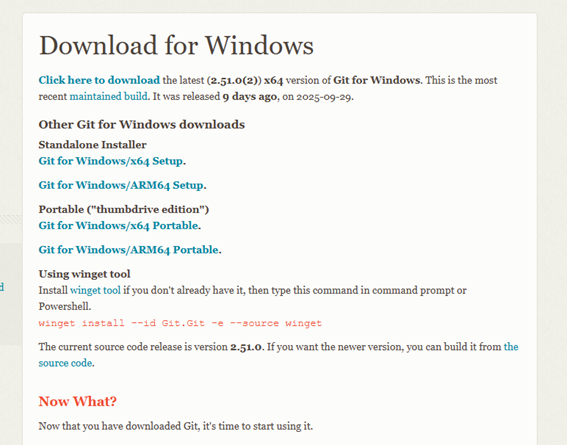
- **Opciones del instalador:** Ejecutar el instalador y mantener las opciones por defecto, marcando:

“Agregar a PATH”
“Registrar como editor de código soportado”

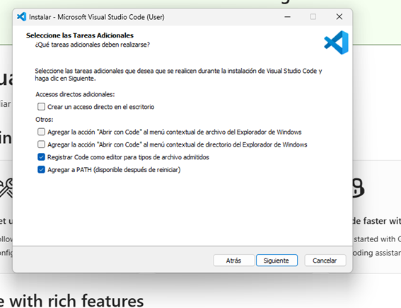

- **Verificación:** Abrir la terminal integrada (`Ctrl+``) y ejecutar:

code --version

Si aparece el número de versión la instalación esta correcta

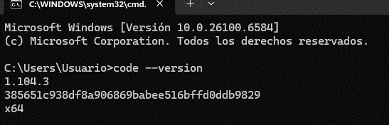

### Uso Básico de VS Code

**Navegación y funcionalidades básicas:**

Navegación por el panel lateral (Explorador, Buscar, Control de versiones, Depuración, Extensiones)
Edición de código con soporte para resaltado de sintaxis y autocompletado
Uso de la paleta de comandos (Ctrl+Shift+P)
Administración de proyectos mediante carpetas

### Personalización del Entorno

**Configuraciones aplicadas:** 

se ha cambiado el tema por uno oscuro para no tener fatiga visual ademas de instalar el git 

**Temas e iconos:**

Temas: One Dark Pro, Material Theme

Iconos: Material Icon Theme, VSCode Icons

**Configuración de fuentes:**

- Fira Code, JetBrains Mono (con ligaduras)

**Atajos de teclado útiles:**

- Ctrl+/ para comentar/descomentar
- Ctrl+Shift+P para paleta de comandos
- Ctrl+` para terminal integrada
- Alt+↑/↓ para mover líneas
- Control + K M para cambiar el idioma
- Shift + Alt + , para corregir errores menores
  
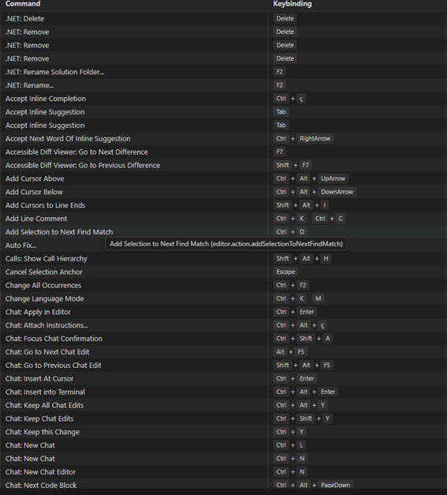

**Configuración del editor:**

- Formateo automático al guardar
- Detección automática de indentación
- Word wrap para líneas largas

**Terminal integrada:**
Ejemplos:
- PowerShell como terminal predeterminado
- Configuración de perfil personalizado

> **Personaliza según tus necesidades**: Estas son sugerencias basadas en prácticas comunes. Experimenta y documenta las configuraciones que encuentres más útiles para tu flujo de trabajo.> 💼 **Manual de Incorporación**: Esta guía establece los estándares del equipo para configurar entornos de desarrollo en C#. Cualquier nuevo desarrollador debe poder seguir estas instrucciones para configurar su entorno de trabajo de manera consistente con el resto del equipo.

### SDK .NET

**Proceso de instalación:**
1. **Descarga e instalación:** [Describir el proceso]
   
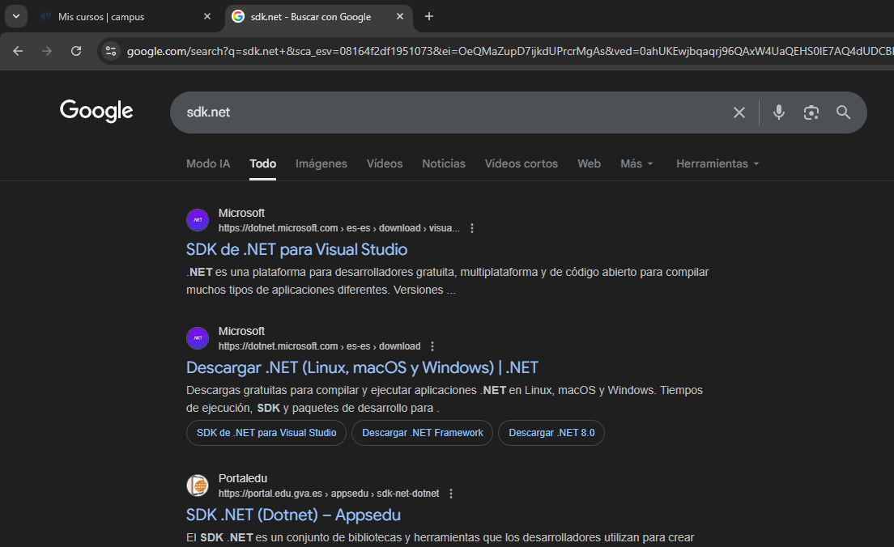
    Primero nos tenemos que meter a la pagina de Microsoft para instalar SDK.net

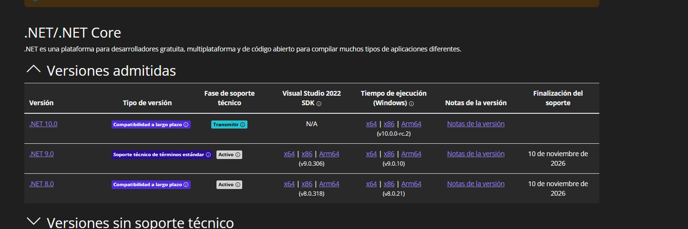
Seleccionamos la version NET 9.0 el de x64 

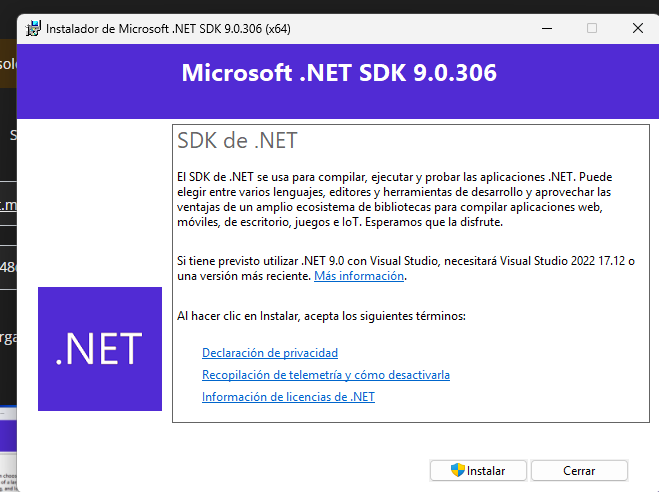
Ejecutamos el archivo que nos descarga y nos aparecera esta ventana, le tendremos que dar a instalar y ya tendriamos instalados SDK.NET

2. **Verificación:** [Cómo comprobar que funciona]
   


Para comprobar que se ha instalado correctamente nos metemos en la terminal y ejecutamos el comando dotnet --version y si te aparece lo que hay en la imagen (9.0.306 la version que instalaste) ya has comprobado que has instalado correctamente SDK.

### Configuración para C#

**Extensiones esenciales:**
- **Soporte oficial para C#**: Extensión que proporciona IntelliSense, debugging y compilación
  .NET Install Tool: Ayuda a instalar y detectar automáticamente el SDK de .NET necesario para ejecutar y compilar programas C#.

C# Dev Kit (opcional): Extensión que mejora la experiencia general de desarrollo, ofreciendo administración de proyectos y explorador de soluciones similar al de Visual Studio.

**Configuraciones específicas para C#:** 
Se configuró el entorno para un formato de código automático, incluyendo la sangría, llaves y espaciados tambien se activó IntelliSense para obtener sugerencias de código y una mejor navegación y se verificaron las opciones del compilador

**Debugging básico:**


 

> **Enfoque práctico**: 
> Se priorizó la configuración de las herramientas básicas necesarias para escribir, ejecutar y depurar programas de C# de manera eficiente en Visual Studio Code.

### Flujo de Trabajo con C#

**Creación de proyectos:**


**Estructura de proyecto:**


**Compilación y ejecución:**
[Proceso para compilar y ejecutar proyectos]

**Debugging:**
[Configuración y uso de debugging]

---

## Visual Studio - IDE Alternativo

### Instalación

**Proceso de instalación:**
- **Descarga:** [Versión recomendada - Community/Professional]

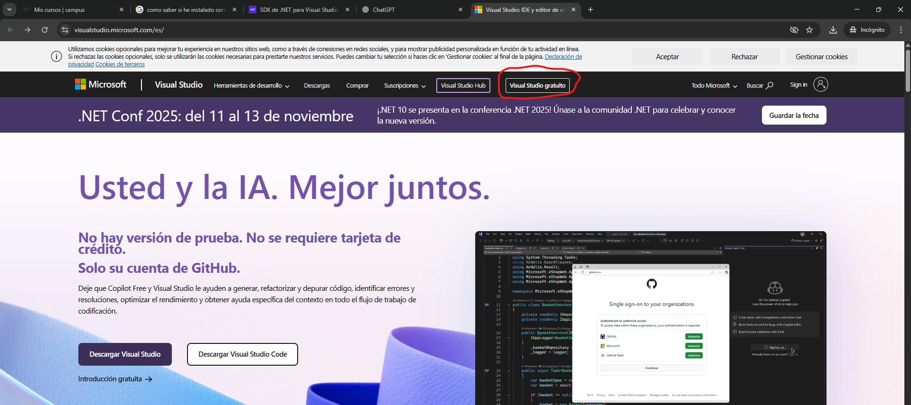
Buscamos en nuestro navegador visual studio y la primera pagina que salga nos metemos, y tendremos que seleccionar la version gratuita 

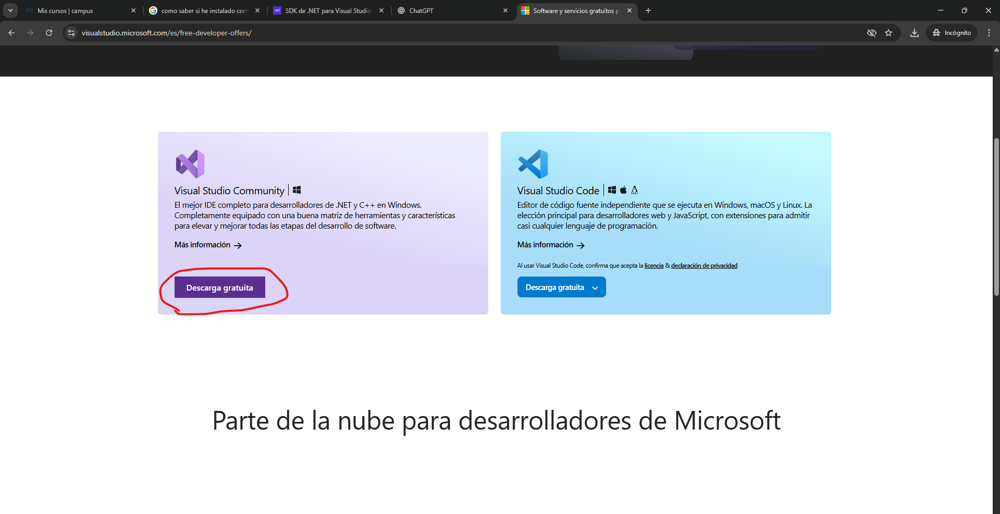
Descargamos la version community y ejecutamos el archivo
  
- **Componentes necesarios:** [Componentes específicos para C#]
  
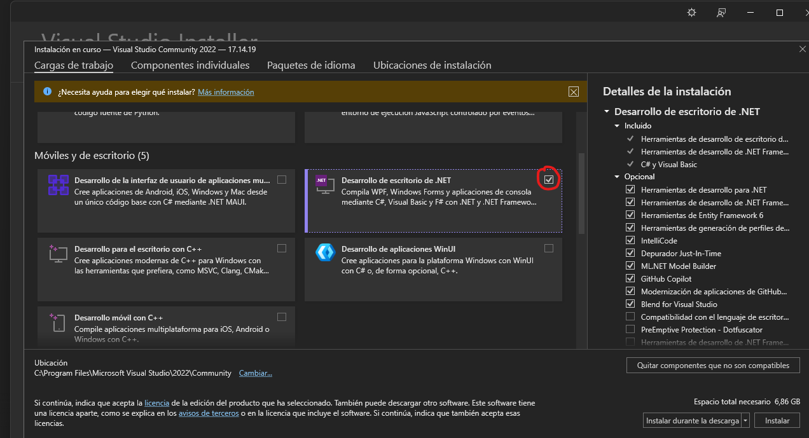
Tenemos que seleccionar una carga de trabajo, la necesaria es la de desarrollo de escritorio .NET, marcamos el cuadro y le damos a instalar ya que nos instalara las herramientas de desarrollo


- **Verificación:** [Cómo confirmar instalación correcta]

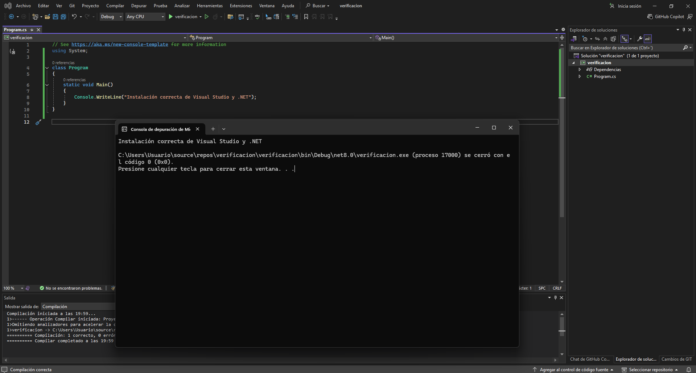

Abrimos visual installer y nos mostrara la version que tenemos instalada

### Desarrollo con C#

**Creación de proyecto:**
ara crear un nuevo proyecto en Visual Studio:


```
Seleccionar “Crear un nuevo proyecto”.
```
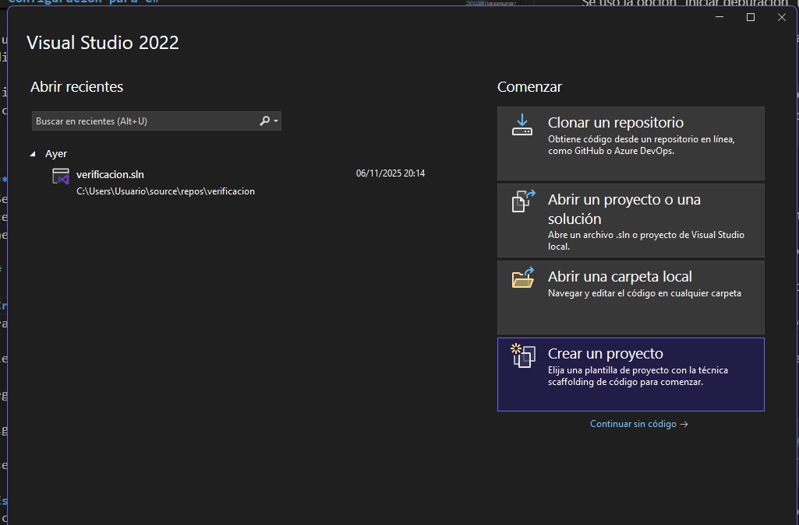

```
Elegir la plantilla “Aplicación de Consola (.NET)” en C#.
```
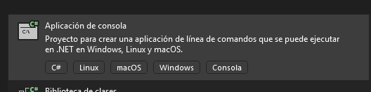

```
Asignar un nombre y ubicación al proyecto.
```
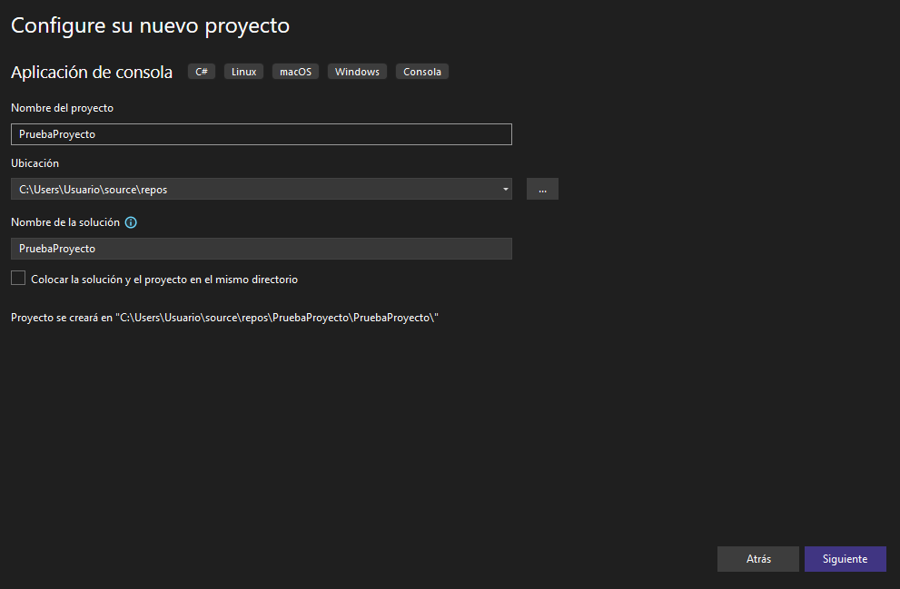


```
Le damos a crear y se nos generara esto 
```
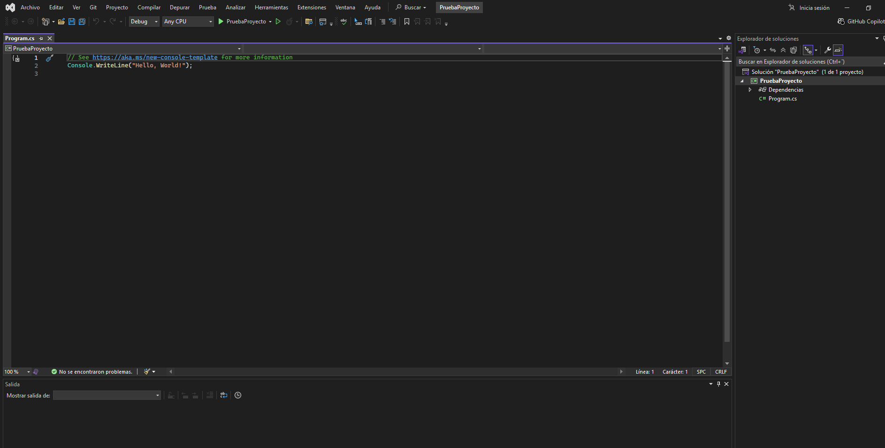

**Flujo de trabajo básico:**
- Compilación y ejecución
- Uso de Solution Explorer
  
- Debugging básico:
  
 Se añadieron puntos de interrupción (breakpoints) para detener la ejecución del programa en líneas específicas

 Se usó la opción “Iniciar depuración” (F5) para ejecutar el código paso a paso

 Se inspeccionaron variables durante la ejecución para verificar su contenido y corregir errores lógicos

---

## Configuración de Lenguaje Adicional

**Lenguaje seleccionado:** [Java/Python/Otro] - **Justificación:** [Por qué se eligió este lenguaje]

### Instalación del Entorno

**Runtime/SDK:**
- **Descarga e instalación:** [Proceso paso a paso]
- **Verificación:** [Cómo confirmar que funciona]

### Configuración en VS Code

**Extensiones por lenguaje:**

*Para Java:*
- **Paquete completo de Java**: Incluye compilación, debugging y gestión de proyectos

*Para Python:*
- **Soporte oficial de Python**: Extensión completa con intérprete y debugging

*Para otros lenguajes:*
- Busca la extensión oficial del lenguaje que proporcione soporte completo

**Configuraciones específicas aplicadas:**
[Documentar los ajustes que se realizaron, como configuración del intérprete, formateo automático, linting, etc.]

### Proyecto de Ejemplo

**Código desarrollado:**
```[lenguaje]
// Código de ejemplo aquí
// Comentarios explicativos
```

**Proceso de ejecución:**
[Describir cómo ejecutar el código]

---

## Configuraciones Recomendadas

**Configuraciones generales:**
[Documentar configuraciones que se consideran útiles para cualquier desarrollador]

**Herramientas adicionales:**
[Extensions, herramientas CLI, o utilidades que se consideran beneficiosas]

**Solución de problemas comunes:**
[Problemas frecuentes durante la configuración y sus soluciones]

**Recursos útiles:**
- Enlace [Enlace]: [Descripción]
- Documentación [Documentación]: [Descripción]

---
